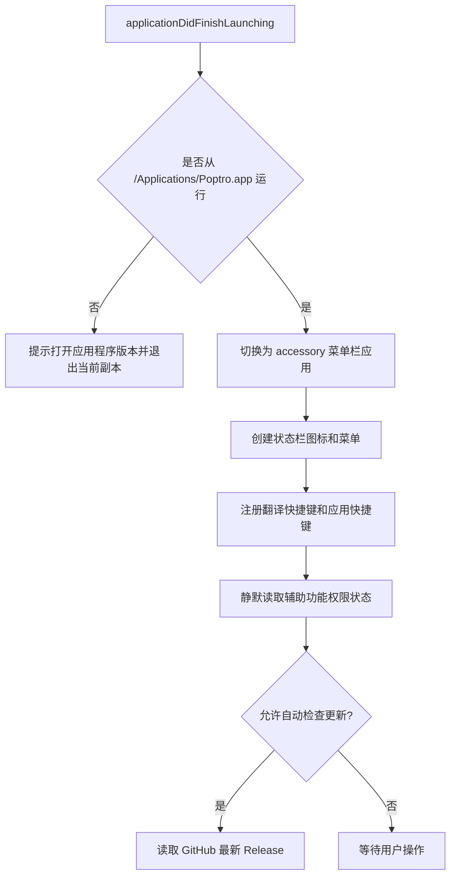
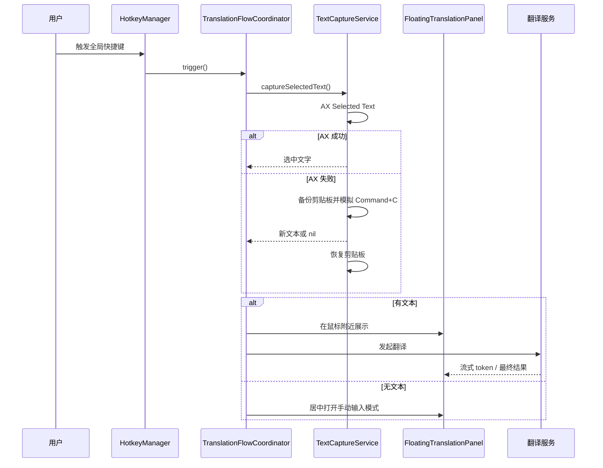

# Poptro 架构说明

## 1. 技术基线

- 平台：macOS 13+
- 语言：Swift 5.9+
- UI：SwiftUI + AppKit
- 包管理：Swift Package Manager
- 快捷键：KeyboardShortcuts
- 更新框架依赖：Sparkle（当前实际更新入口使用 GitHub Releases API）
- 应用形态：`LSUIElement` 菜单栏应用，不启用 App Sandbox

## 2. 模块边界

```text
App / AppDelegate
├── 菜单栏、设置窗口、启动检查
├── InstallationManager      固定 /Applications 运行身份
├── PermissionManager        辅助功能权限静默检查与显式引导
├── HotkeyManager            内置翻译快捷键
└── AppLauncher              动态应用快捷键

TranslationFlowCoordinator   翻译流程唯一编排入口
├── TextCaptureService       AX 取词 → 模拟复制兜底
├── LanguageDetector         识别源语言并选择目标语言
├── TranslationService       OpenAI 兼容流式接口
├── AppleTranslationService  Apple 本地翻译与 SwiftUI session 桥接
├── DeepLService             DeepL 接口
├── GoogleAIService          Gemini 接口
├── OllamaService            本地模型接口
└── FloatingTranslationPanel NSPanel + SwiftUI 双栏界面

Settings / Persistence
├── SettingsView             通用、快捷键、服务、关于
├── AppPreferencesStore      外观、语言、自动检查更新
├── TranslationSettings      服务、模型、语言、Prompt
├── LocalStore               Application Support JSON
└── KeychainHelper           本机 AES-GCM API Key 存储（历史名称保留）
```

## 3. 启动流程



启动阶段不得主动弹辅助功能授权框。权限提示只允许由用户在设置中显式触发。

## 4. 翻译数据流



每次请求生成新的 `activeTranslationID`。异步回调必须先验证 ID，避免旧请求污染新面板。

## 5. 权限和应用身份

macOS 的辅助功能权限由 TCC 管理，并与应用的路径、Bundle Identifier、签名身份等共同相关。
因此项目把 `/Applications/Poptro.app` 作为唯一正式运行位置：

- 不从源码目录中的 `Poptro.app` 日常运行。
- 不从 DMG 挂载卷直接运行。
- 不让同名 App 的多个副本长期存在。
- 本地验证必须先固定构建产物，再只对该副本授权。

Bundle Identifier 当前为 `com.menubartranslator.app`。这是为兼容历史配置和授权记录而保留，
不能仅为了品牌名称统一随意修改。

## 6. 数据存储

| 数据 | 存储位置 | 备注 |
| --- | --- | --- |
| 翻译设置 | `~/Library/Application Support/Poptro/translation_settings.json` | Codable，缺失字段使用稳定默认值 |
| 通用偏好 | `~/Library/Application Support/Poptro/app_preferences.json` | 界面语言、外观、玻璃、更新检查 |
| 窗口位置和尺寸 | `~/Library/Application Support/Poptro/panel_position.json` | 多屏幕显示时会限制到可见区域 |
| 服务测速 | `~/Library/Application Support/Poptro/provider_benchmarks.json` | 不保存翻译正文 |
| 应用快捷键 | `launch_bindings.json` + KeyboardShortcuts 的 UserDefaults | 绑定记录和按键值分层保存，动态名称保持稳定 |
| API Key | UserDefaults 中的 AES-GCM 密文 | 只在本机使用；不是明文 JSON |

新增 Codable 字段必须使用 `decodeIfPresent` 和稳定默认值，确保旧配置可以向前迁移。

## 7. 更新与发布

当前稳定路径：

```text
版本号 + 构建号更新
    → main 提交
    → 推送 vX.Y.Z 标签
    → GitHub Release workflow
    → build.sh 生成 Poptro.app / DMG / ZIP
    → ad-hoc 签名
    → GitHub Release 公开资产
    → 应用通过 GitHub API 检测新版本并打开 DMG
```

Developer ID 公证工作流是另一条显式、手动触发的路径，未配置 Apple Secrets 时不得假设它可用。
